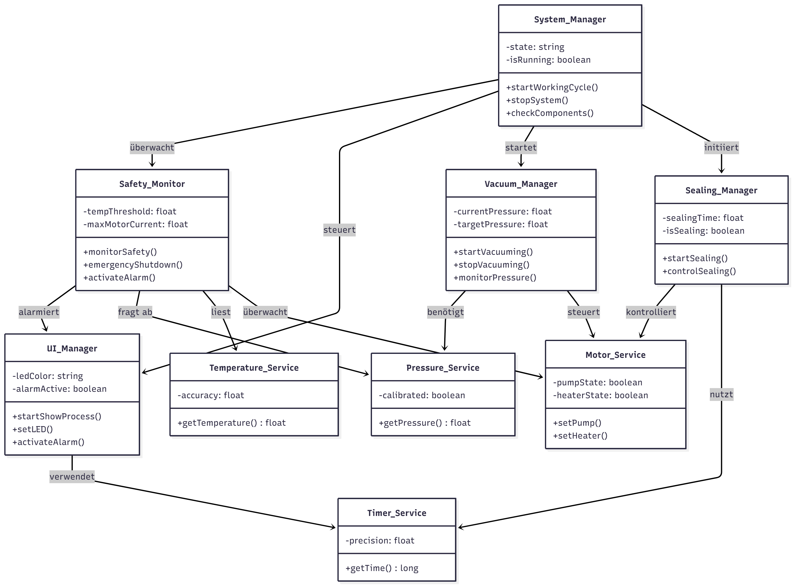
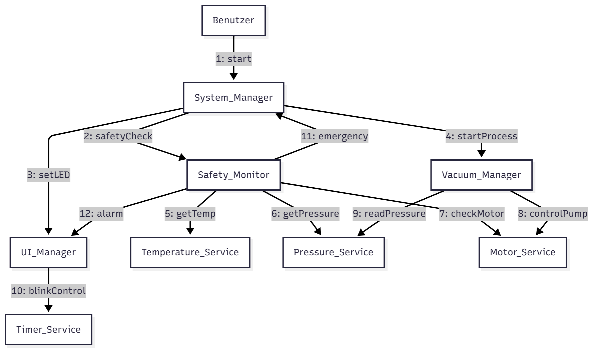

# Sprint 1 Requirements Traceability Matrix

| Requirement ID | Beschreibung | Priorität | Komponente | Begründung | 
|---------------|--------------|-----------|------------|----------|
| F-START-1 | System startet Arbeitszyklus nach Drücken der Starttaste | Mittel | System_Manager | Grundfunktionalität | 
| F-START-2 | System stoppt innerhalb von 100 ms nach Drücken der Stoptaste | Hoch | System_Manager | Sicherheitsrelevantes Stoppen |
| F-START-3 | System prüft vor Start alle kritischen Komponenten und meldet Status innerhalb von 2 s | Hoch | System_Manager | Vorstart-Sicherheitsprüfung | 
| F-SICHERHEIT-1 | Abschaltung bei >80 °C (±2 °C Genauigkeit) | Kritisch | Safety_Monitor | Kritische Sicherheitsfunktion | 
| F-SICHERHEIT-2 | Stoppt innerhalb von 200 ms bei geöffneter Abdeckung | Kritisch | Safety_Monitor | Kritische Sicherheitsfunktion | 
| F-SICHERHEIT-3 | Abschaltung innerhalb von 200 ms bei Motorblockade | Kritisch | Safety_Monitor | Kritische Sicherheitsfunktion | 
| NF-ZEIT-1 | Reaktionszeit auf Sicherheitsereignisse ≤200 ms bei 25°C | Kritisch | Safety_Monitor | Zeitkritisches Safety |

---

## Klassendiagramm

## Sequenzdiagramm

## Kommunikationsdiagramm

