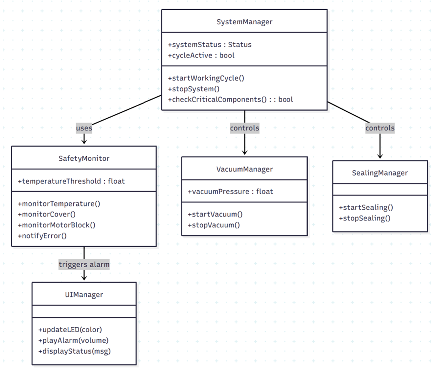
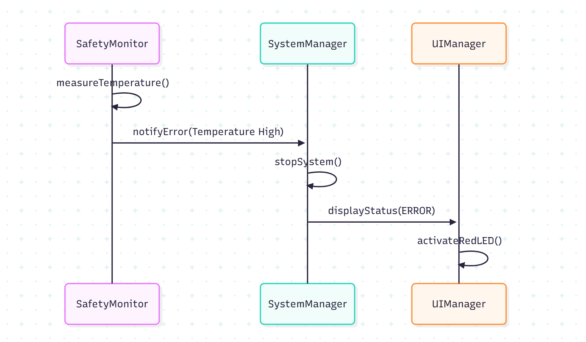
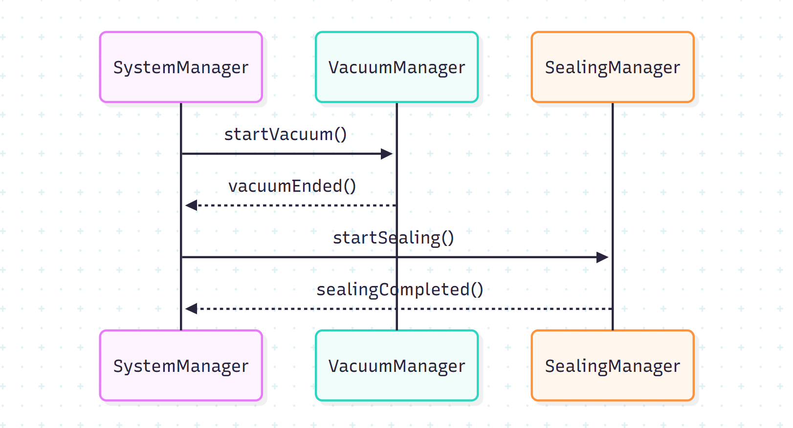
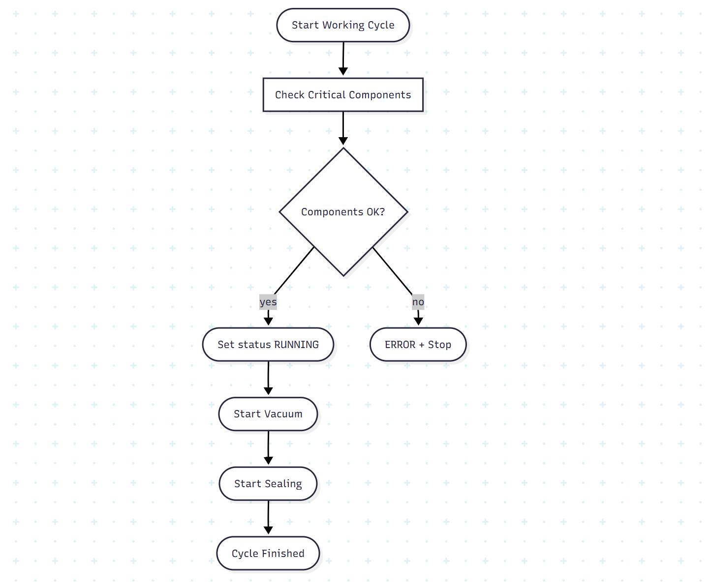
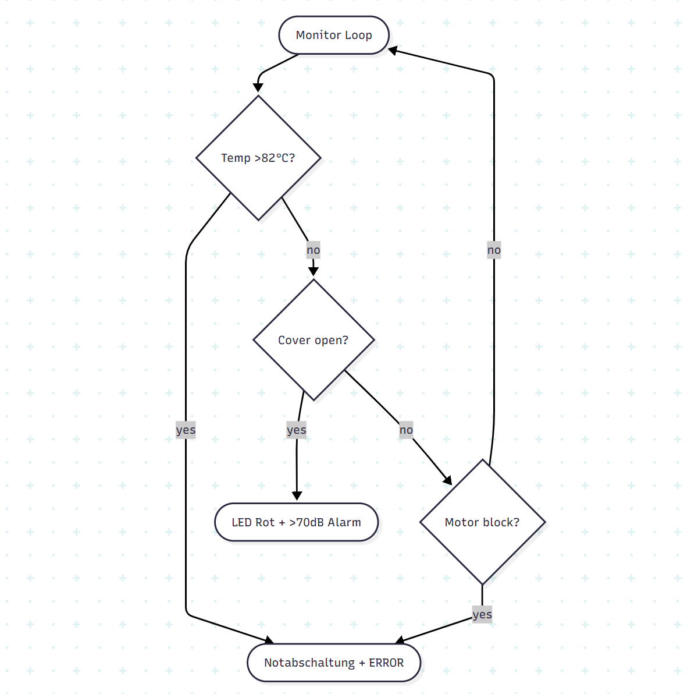

# Traceability Matrix – Sprint 2

| Requirement ID | Beschreibung (Kurz) | Sprint | Architektur | Klasse(n) | Methode(n) | Testfall(e) |
|----------------|---------------------|--------|-------------|-----------|------------|--------------|
| F-VACUUM-1 | Vakuumprozess starten sobald System läuft | Sprint 2 | Application Layer | VacuumManager | startVacuuming() | UT4 |
| F-VACUUM-2 | Vakuumende erkennen bei Zielunterdruck | Sprint 2 | Application Layer | VacuumManager | isTargetPressureReached() | UT5 |
| F-VACUUM-3 | Benachrichtigung an System_Manager bei Vakuumende | Sprint 2 | Application Layer | VacuumManager → SystemManager | notifyVacuumDone(), handleVacuumDone() | IT4 |
| F-TIMER-1 | 200 ms Verzögerung zwischen Vakuumende und Versiegelungsstart | Sprint 2 | Timing Layer | SystemManager | delayedStartSealing() | UT6 |
| F-SEAL-1 | Versiegelungszeit präzise steuern (2000 ms ±50 ms) | Sprint 2 | Application Layer | SealingManager | controlSealing() | UT7 |
| F-SEAL-2 | Versiegelungsprozess nach Vakuum automatisch starten | Sprint 2 | Application Layer | SystemManager | startSealingProcess() | IT4 |
| F-SEAL-3 | Rückmeldung „Sealing beendet“ an System_Manager | Sprint 2 | Application Layer | SealingManager → SystemManager | notifySealingDone(), handleSealingDone() | IT5 |
| F-UI-2 | LED/Display zeigt Vakuum- und Versiegelungsstatus an | Sprint 2 | Presentation Layer | UIManager | showVacuumStatus(), showSealingStatus() | IT4 |
| F-SAFETY-4 | Temperatur-/Cover-/Motor-Überwachung bleibt während Vacuum/Sealing aktiv | Sprint 2 | Safety Layer | SafetyMonitor | monitorTemperature(), monitorCover() | IT5 |
| F-SAFETY-5 | Notabschaltung während Vacuum/Sealing möglich (≤200 ms) | Sprint 2 | Safety Layer | SafetyMonitor | emergencyShutdown() | IT5 |
| NF-ZEIT-2 | Genauigkeit Timer-Funktionen ±10 ms | Sprint 2 | Timing Layer | TimerService | getTimestamp(), sleepMs() | UT8 |
| NF-ARCH-1 | Asynchrone Architektur für Vacuum/Sealing/Safety | Sprint 2 | System Architekturebene | SystemManager, VacuumManager, SealingManager | Thread-Lifecycle-Management | Review |

## 1. Klassendiagramm

### Beschreibung des Klassendiagramms

Das Klassendiagramm zeigt die erweiterten Software-Komponenten des Systems nach Sprint 2. 
Auf Grundlage der bereits in Sprint 1 implementierten Kernlogik wurde die Funktionalität 
für Vakuumsteuerung, Drucküberwachung, Temperaturregelung und Versiegelungsprozess 
wesentlich erweitert.

Die Schichtenstruktur bleibt erhalten (UI → Application Layer → HAL), jedoch wurden 
neue Klassen wie `Vacuum_Controller`, `Pressure_Service`, `Sealing_Controller` und 
`Heater_Control` ergänzt. Diese Klassen realisieren die neuen Anforderungen aus Sprint 2:

- **Vakuumsteuerung:** Erreichen und Halten des Zielvakuums.
- **Druckmessung und Trendanalyse:** Über `Pressure_Service`.
- **Temperaturregelung während der Versiegelung:** Über `Temperature_Service` und `Heater_Control`.
- **Steuerung des gesamten Versiegelungsablaufs:** Durch `Sealing_Controller`.
- **Erweiterung der Sicherheit:** Safety_Monitor erhält zusätzliche Prüfungen (z. B. Temperaturtrend, 
  Zeitüberschreitung im Heizprozess).
- **UI-Erweiterung:** LED/Sound-Ausgabe für neue Prozesszustände (VAKUUM, SEALING, COOLING).

Die Beziehungen zwischen den Klassen zeigen klar die Verantwortlichkeiten:
- High-Level-Logik liegt in `Process_Coordinator`.
- Physikalische Messwerte kommen über HAL-Services (`Pressure_Service`, `Temperature_Service`).
- Aktoren (Pumpe, Heizelement) werden über `Vacuum_Controller` und `Heater_Control` angesteuert.
- Die UI schaltet Statusanzeigen je nach Prozessfortschritt.

## 2. Sequenzdiagramm

### Beschreibung des Sequenzdiagramms 

Das Sequenzdiagramm beschreibt den vollständigen Ablauf eines Arbeitszyklus im Sprint 2 
– beginnend mit der Aktivierung des Vakuums bis zum Abschluss des Versiegelns.

1. Der Benutzer startet den Zyklus über den UI_Controller.
2. Der Process_Coordinator ruft den Vacuum_Controller auf, um das Zielvakuum zu erreichen.
3. Der Pressure_Service liefert kontinuierlich Druckwerte zur Steuerung.
4. Nach Erreichen des Zielvakuums beginnt der Sealing_Controller den Versiegelungsprozess.
5. Der Temperature_Service liefert Sensordaten für die Temperaturregelung.
6. Der Heater_Control aktiviert und regelt das Heizelement.
7. Der Safety_Monitor überwacht permanent kritische Grenzwerte.
8. UI_Controller visualisiert jeden Prozesszustand (LEDs/Töne).
9. Nach Abschluss des Versiegelns steuert der Process_Coordinator den COOLING-Abschnitt ein.

Dieses Diagramm zeigt deutlich:
- die exakte Reihenfolge der Abläufe,
- die Interaktion zwischen Controller, Sensoren und Aktoren,
- die Rolle des Safety_Monitors,
- sowie die erweiterte UI-Prozessvisualisierung.

## 3. Aktivitätsdiagramm

### Beschreibung des Aktivitätsdiagramms 

Das Aktivitätsdiagramm zeigt den systematischen Ablauf eines kompletten Arbeitszyklus im Sprint 2. Dieser Ablauf umfasst:

- Start des Systems
- Prüfung sicherheitsrelevanter Komponenten
- Aktivierung der Vakuumpumpe
- Regelung des Zielvakuums
- Übergang zum Versiegelungsprozess
- Temperaturüberwachung und Heizsteuerung
- Kühlphase
- Abschluss des Prozesses oder Notabschaltung im Fehlerfall

Neu in Sprint 2 sind insbesondere:
- Druckregelung während VAKUUM
- Dynamische Temperaturregelung beim Versiegeln
- Cooling-Phase als sicherer Abschluss
- Safety-Zweige für Übertemperatur, Zeitüberschreitung und Pumpenfehler

Das Diagramm verdeutlicht die logische Struktur des Prozesses und wie das System sicher zwischen den verschiedenen Zuständen wechselt.

