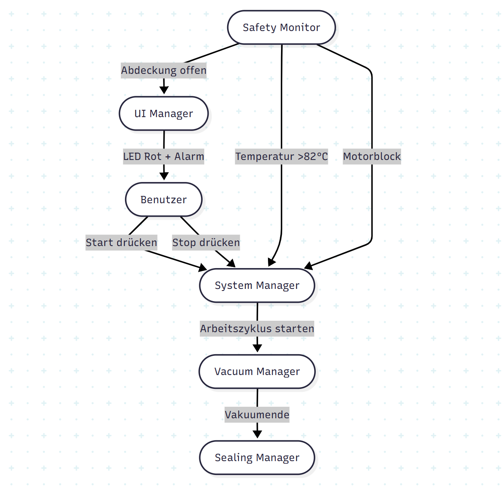

## Sprint 2 – Überblick

Im Sprint 2 ist das Ziel, die Systemfunktionalität zu erweitern und einen vollständigen **Vakuum- und Versiegelungsprozess** zu implementieren. Zusätzlich werden **Timermechanismen** und eine **erweiterte Sicherheitsüberwachung** eingeführt.  

**Kernziele:**

- Automatischer Start und Überwachung des Vakuumprozesses  
- Automatischer Start des Versiegelungsprozesses nach Abschluss des Vakuums  
- Nutzung eines Timers zur Einhaltung zeitkritischer Abläufe  
- Erweiterung des Safety_Monitor zur Überwachung während Vakuum- und Versiegelungsprozess  
- Integration der neuen Module in System_Manager und Safety_Monitor  

---

## Sprint Planning

- Auswahl der dringendsten Anforderungen für Implementierung und Test  
- Implementierung der Logik in **VacuumManager** und **SealingManager**  
- Implementierung von **TimerService** für Verzögerungen und periodische Aufgaben  
- Erweiterung des **SafetyMonitor** zur kontinuierlichen Überwachung von Temperatur, Cover und Motor  
- Erweiterung von **UIManager**, um Vakuum- und Versiegelungszustände anzuzeigen  

---

## Anforderungen

| Requirement-ID | Beschreibung | Sprint | Architektur | Klasse | Methode |
|----------------|-------------|--------|-------------|--------|---------|
| F-VACUUM-1 | Startet Vakuumprozess | Sprint 2 | Process | Vacuum_Manager | startVacuum() |
| F-VACUUM-2 | Überwacht Drucksensor | Sprint 2 | Process | Vacuum_Manager | monitorPressure() |
| F-SEAL-1 | Startet Versiegelung nach Vakuum | Sprint 2 | Process | Sealing_Manager | startSealing() |
| F-TIMER-1 | Timerfunktion für Prozesse | Sprint 2 | Core | Timer_Service | startTimer() |
| F-TIMER-2 | Timer-Callback Ereignis | Sprint 2 | Core | Timer_Service | onTimeout() |
| F-SAFETY-4 | Sicherheit während Vakuum & Sealing | Sprint 2 | Safety | Safety_Monitor | monitorDuringProcess() |

---

## Design

**System_Manager**  
- Koordiniert den Vakuum- und Versiegelungsprozess  
- Ruft **TimerService** für zeitgesteuerte Abläufe auf  
- Reagiert auf Benachrichtigungen von **VacuumManager** und **SealingManager**  

**VacuumManager**  
- Steuert die Vakuumpumpe  
- Liest Sensorwerte von **PressureService**  
- Benachrichtigt SystemManager, sobald der Ziel-Druck erreicht ist  

**SealingManager**  
- Steuert den Versiegelungsprozess  
- Benachrichtigt SystemManager nach Abschluss  

**TimerService**  
- Bietet verzögerte und periodische Aufrufe  
- Unterstützt die Einhaltung zeitkritischer Abläufe  

**SafetyMonitor**  
- Überwacht kontinuierlich Temperatur, Cover, Motor und andere sicherheitskritische Parameter  
- Führt im Fehlerfall einen Notstopp aus  

**UIManager**  
- Zeigt Vakuum- und Versiegelungsstatus in Echtzeit an  
- LED- und akustische Signale informieren den Benutzer über Prozessstatus  

**UML-Design:**  
- Klassendiagramm zeigt neue Klassen und deren Beziehungen zu SystemManager  
- Sequenzdiagramm beschreibt den vollständigen Ablauf: Start → Vakuum → Versiegelung → Cooling → Prozessende  
- Aktivitätsdiagramm zeigt Prozessablauf und Sicherheitszweige (Übertemperatur, Cover offen, Motorblockade)  

---

## Abweichungen zu Sprint 1

| Abweichung | Beschreibung |
|------------|-------------|
| A1 – Asynchrone Architektur | Sprint 1 noch synchron, Sprint 2 führt Threads und Timer zur asynchronen Prozesssteuerung ein |
| A2 – SafetyMonitor | Sprint 1 Methoden nur stub, Sprint 2 vollständige Implementierung von monitorDuringProcess() |
| A3 – UI | Sprint 1 nur LED/Sound, Sprint 2 Anzeige von Vakuum- und Versiegelungsstatus |
| T1 – Traceability | Sprint 1 Vakuum- und Versiegelungsfunktionen nicht implementiert, Sprint 2 vollständig realisiert |
| D1 – Event-Mechanismus | Sprint 1 synchron, Sprint 2 nutzt Callbacks/Events für Prozesssteuerung |

---

## Baseline Sprint 2

- **Implementiert:** Vollständige Logik von VacuumManager, SealingManager, TimerService, SafetyMonitor  
- **Getestet:** Unit- und Integrationstests decken Hauptprozesse ab  
- **Nicht implementiert:** Optimierung asynchroner Events, UI Animationen, Logging  
- **Dokumentation:** Traceability Matrix, UML-Diagramme, Testberichte