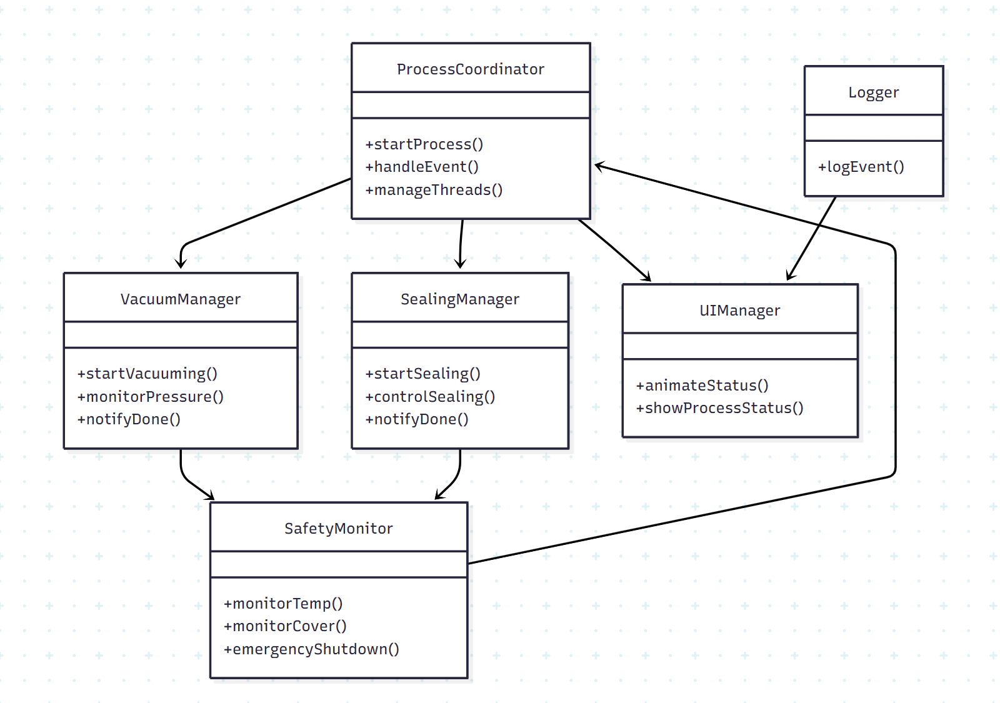
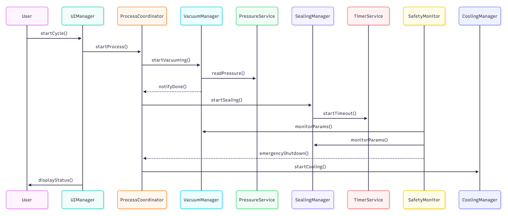
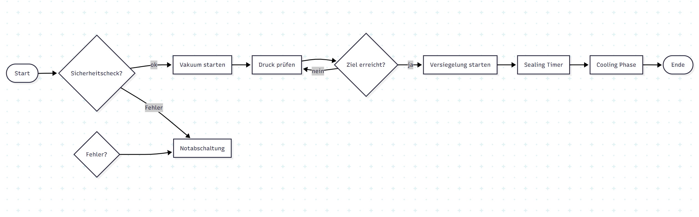

# Traceability Matrix – Sprint 3

| Requirement ID | Beschreibung (Kurz) | Sprint | Architektur | Klasse(n) | Methode(n) | Testfall(e) |
|----------------|--------------------|--------|-------------|-----------|------------|--------------|
| F-LOG-1 | Logging aller Prozessschritte | Sprint 3 | Infrastructure Layer | Logger | logEvent() | UT9 |
| F-UI-3 | Erweiterte UI-Animationen und Statusanzeige | Sprint 3 | Presentation Layer | UIManager | animateStatus(), showProcessStatus() | IT6 |
| F-ERROR-1 | Fehlerbehandlung bei Hardwarefehler | Sprint 3 | Safety Layer | SafetyMonitor, HardwareInterface | handleHardwareError(), emergencyShutdown() | IT7 |
| F-ERROR-2 | Fehlerbehandlung bei Sensor-Ausfall | Sprint 3 | Safety Layer | SafetyMonitor, SensorInterface | handleSensorError(), emergencyShutdown() | IT8 |
| F-TIMER-3 | Timeout überwacht Prozessdauer | Sprint 3 | Timing Layer | TimerService | startTimeout(), onTimeout() | UT10 |
| F-COORD-1 | Prozesskoordination inkl. Fehler-Events | Sprint 3 | Application Layer | ProcessCoordinator | startProcess(), handleEvent() | IT9 |
| NF-ARCH-2 | Thread-Synchronisation und Event-Queue stabil | Sprint 3 | System Architekturebene | ProcessCoordinator, VacuumManager, SealingManager | manageThreads(), dispatchEvent() | Review |

---

## 1. Klassendiagramm

### Beschreibung des Klassendiagramms

Das Klassendiagramm für Sprint 3 zeigt die neuen Komponenten und Erweiterungen:

- **ProcessCoordinator**: zentrale Koordination von Vakuum-, Versiegelungs- und Cooling-Prozessen, inklusive Fehler-Events.  
- **VacuumManager / SealingManager**: ergänzt um Logging und Fehlerbehandlung.  
- **SafetyMonitor**: erweiterte Sicherheitsüberwachung, reagiert auf Sensor- und Hardwarefehler.  
- **UIManager**: erweitert um Animationen, visuelle Rückmeldung bei Fehlern und Prozessschritten.  
- **Logger**: neue Infrastrukturklasse für persistentes Event-Logging.  
- **HardwareInterface / SensorInterface**: simulieren mögliche Hardware- und Sensorszenarien für Tests.  

Beziehungen:  
- ProcessCoordinator steuert Manager und SafetyMonitor.  
- Logger empfängt Events von allen Komponenten.  
- UIManager zeigt Status und Fehlerzustände basierend auf Logger- und ProcessCoordinator-Daten.  

---

## 2. Sequenzdiagramm

### Beschreibung des Sequenzdiagramms

Sequenz für Prozess + Fehlerbehandlung:

1. Benutzer startet Arbeitszyklus über UI.  
2. ProcessCoordinator initiiert Vakuumprozess (VacuumManager).  
3. VacuumManager überwacht Druck via PressureService.  
4. Fehler oder Ziel erreicht → Event an ProcessCoordinator und Logger.  
5. ProcessCoordinator startet Versiegelung (SealingManager).  
6. SafetyMonitor überwacht parallel Temperatur, Cover, Motor; löst ggf. Notabschaltung aus.  
7. Logger protokolliert alle Prozessschritte und Fehler.  
8. UIManager zeigt Echtzeitstatus inkl. Animationen.  
9. Nach Abschluss oder Notabschaltung → Cooling / Prozessende.  

---

## 3. Aktivitätsdiagramm

### Beschreibung des Aktivitätsdiagramms

Der Ablauf im Sprint 3 umfasst:

- Start → Prüfung kritischer Komponenten  
- Vakuum starten → Druck überwachen → Logging  
- Versiegelung starten → Timer überwachen → Logging  
- Cooling → Sensorwerte prüfen → Logging  
- Fehlerfall → Notabschaltung + Logging  
- Prozessende → Statusanzeige inkl. UI-Animationen  

Neu in Sprint 3:  
- Fehlerbehandlung bei Hardware- oder Sensorproblemen  
- Logging aller Ereignisse  
- Erweiterte UI mit Animationen  
- Thread-Synchronisation und Event-Queue für stabile parallele Abläufe  
